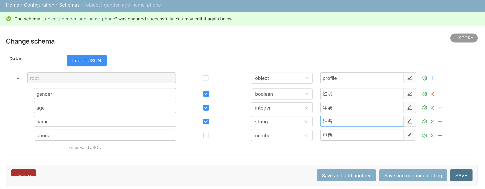
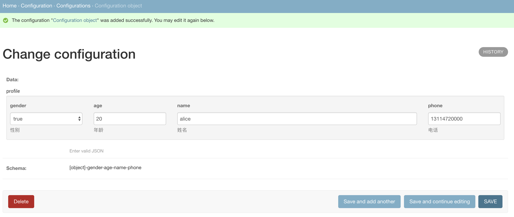
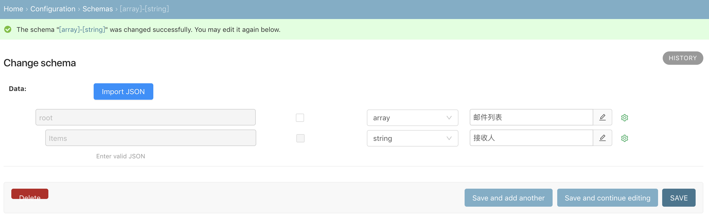
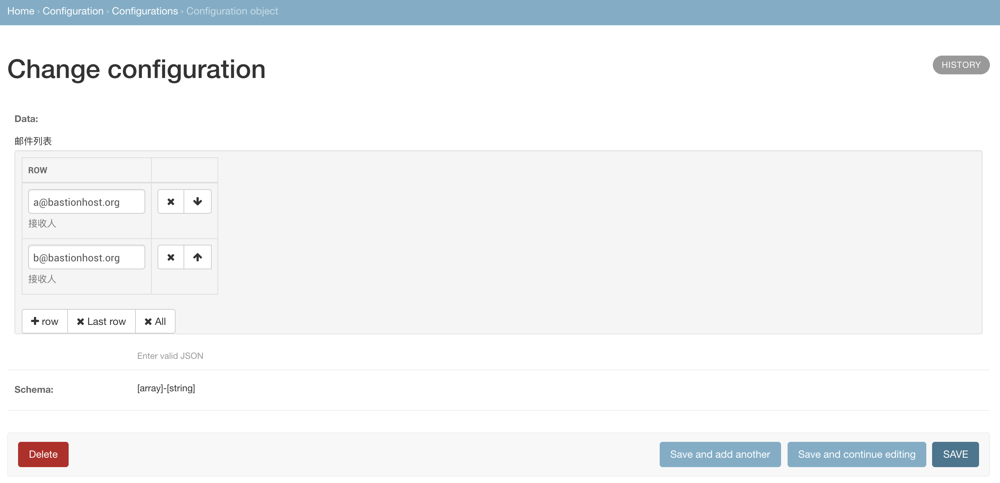

# clovers

Flexible configuration management, for non developers !

## Samples

create a object type with schema editor

create a specific object with the object type

create a array type with schema editor

create a specific array with the array type

## Installation

To set up a development environment quickly, install Python 2.x first. It
comes with virtualenv built-in. so create a virtual environment with:

`virtualenv env`

`source env/bin/activate`

Install dependencies:

`pip install -r requirements.txt`

Run server:

`python manage.py runserver --settings=clovers.settings.dev`
